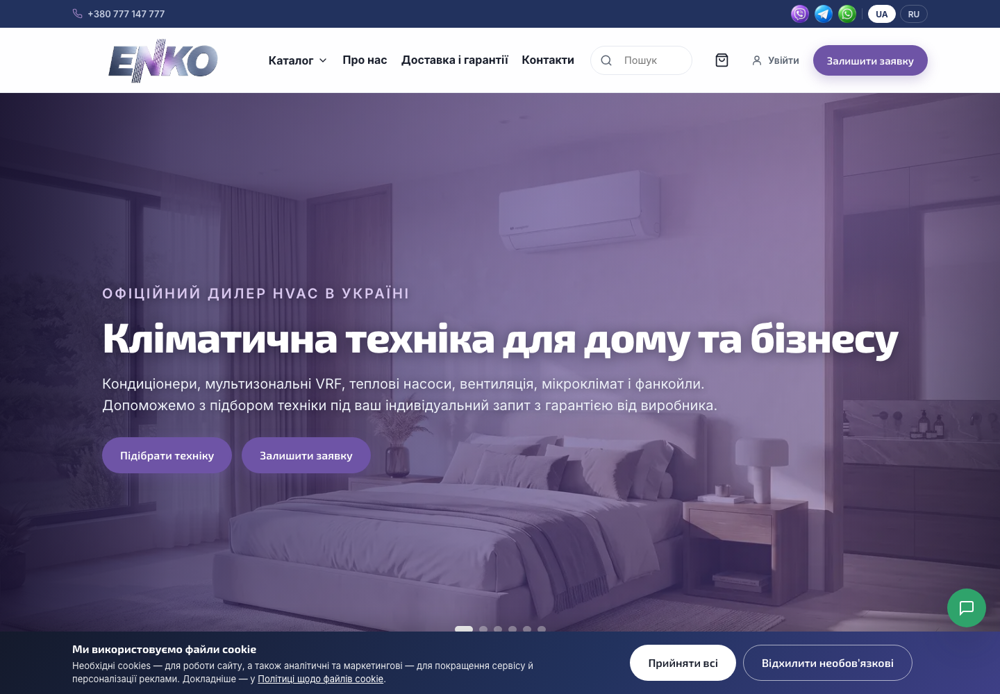
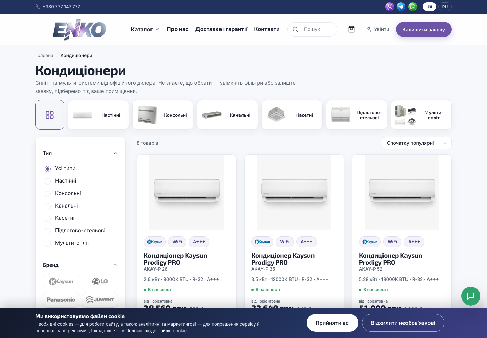
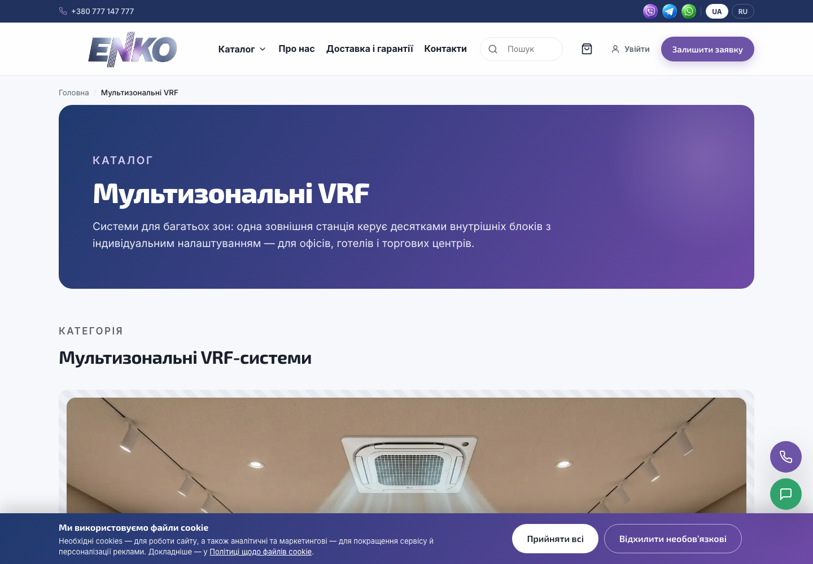

# ENKO — HVAC-каталог на WordPress

Реалізація каталогу кліматичного обладнання на WordPress + WooCommerce у режимі
запиту комерційної пропозиції (без онлайн-оплати): власна класична тема,
плагін бізнес-логіки з 24 модулів, двомовний інтерфейс, кабінети користувача
та менеджера, інтеграції з Telegram і Google Sheets.

**Продакшн:** [enkogroup.com.ua](https://enkogroup.com.ua)
**Обсяг коду:** PHP — 6 818 рядків · JavaScript — 4 165 · CSS — 2 361

---

## Скріншоти



| Каталог із фільтрами | Сторінка категорії |
|---|---|
|  |  |

---

## Огляд

**Предметна область.** Постачальник кліматичної техніки: кондиціонери, мультизональні
системи VRF, теплові насоси, вентиляція, фанкойли. Кінцева вартість залежить від
комплектації, доставки й монтажу, тому фіксована ціна та онлайн-оплата не застосовні.

**Модель взаємодії.** Відвідувач формує заявку з позицій каталогу; відправлення заявки
створює замовлення WooCommerce у статусі `on-hold` і надсилає сповіщення менеджеру
(email + Telegram). Розрахунок вартості виконується поза сайтом.

**Вихідні дані.** Статичний HTML/CSS/JS-прототип із власним дизайном (каталог `prototype/`).
**Результат.** WordPress-реалізація з попіксельною відповідністю прототипу та повним
набором серверної логіки.

---

## Архітектура

Кодова база розділена на два незалежні шари з різними життєвими циклами:

```
wordpress/
├── themes/enko/              тема (презентаційний шар)
│   ├── *.php                 14 шаблонів сторінок
│   ├── woocommerce/          3 оверрайди шаблонів WooCommerce
│   ├── styles/               4 CSS-файли (перенесені з прототипу без змін)
│   └── scripts/              3 JS-файли (перенесені з прототипу без змін)
├── plugins/enko-core/        плагін (доменна логіка)
│   ├── inc/                  24 модулі
│   └── assets/               клієнтські скрипти підсистем
└── dropins/                  advanced-cache.php + конфігураційні сніпети
```

**Обґрунтування розділення.** Уся доменна логіка (ціноутворення, знижки, заявки, кабінети,
інтеграції) зосереджена у плагіні та не залежить від активної теми. Тема містить лише
шаблони й ресурси прототипу. Наслідки: зміна або оновлення теми не впливає на бізнес-процеси;
логіка залишається працездатною при деактивації теми; шаблони прототипу переносяться
без адаптації під API плагіна.

**Взаємодія шарів** — через хуки WordPress/WooCommerce (`woocommerce_get_price_html`,
`template_include`, `wp_head`, `send_headers`) і REST-простір `enko/v1/*`. Прямих викликів
функцій плагіна з шаблонів мінімізовано; де вони потрібні — обгорнуті в `function_exists()`.

### Модулі плагіна

| Модуль | Призначення |
|---|---|
| `catalog-mode.php` | переведення WooCommerce у режим каталогу: вимкнення оплати, підміна дій кошика |
| `pricing.php` | подвійне відображення цін ₴/€ з перерахунком за поточним курсом |
| `discount.php` | персональні знижки на рівні користувача через фільтри ціни WooCommerce |
| `cart.php` | гібридний кошик: стан у браузері, створення замовлення на сервері |
| `request-flow.php` | обробка заявок з форм, сповіщення менеджеру (email + Telegram) |
| `catalog-data.php` | підготовка даних товару для клієнтських скриптів (варіації, характеристики) |
| `catalog-sync.php` | імпорт та оновлення каталогу з Google Sheets (CSV), звіт про синхронізацію |
| `account.php` | реєстрація, автентифікація, профіль, історія заявок, чат клієнта |
| `manager.php` | кабінет менеджера: клієнти, знижки, курс, налаштування, чат |
| `telegram.php` | двосторонній міст із Telegram через Bot API і Topics |
| `guest-chat.php` | чат для неавторизованих відвідувачів з ідентифікацією за UUID |
| `i18n.php` | двомовність UA/RU: серверні рядки, клієнтська карта, RU-поля товарів |
| `search.php` | пошуковий індекс і REST-ендпоінт автодоповнення |
| `seo.php` | meta-опис, Open Graph, Twitter Cards, JSON-LD Organization |
| `visibility.php` | керування індексацією: склад sitemap, `noindex` для службових сторінок |
| `security.php` | транспортні заголовки, обмеження частоти запитів, honeypot-перевірки |
| `page-cache.php` | інвалідація файлового кешу сторінок за подіями зміни контенту |
| `media.php` | контроль генерації похідних розмірів зображень |
| `backup.php` | резервне копіювання БД: потоковий дамп, ротація, відновлення |
| `docs.php` | документи товару: прив'язка PDF, перегляд і завантаження |
| `settings.php` | сторінка налаштувань, реєстрація та санітизація опцій |
| `frontend-popups.php` | підключення клієнтських скриптів, передача конфігурації у фронтенд |
| `mailer.php` | конфігурація SMTP-транспорту для `wp_mail` |
| `redirects.php` | маршрутизація та перенаправлення застарілих URL |

---

## Реалізація підсистем

**Ціноутворення.** Ціни зберігаються у євро в метаполі товару; гривнева ціна обчислюється
за курсом з опції на етапі `woocommerce_product_get_price`. Персональна знижка застосовується
тим самим фільтром, тому коректно відображається в каталозі, картці товару, кошику й у
підсумках замовлення без дублювання логіки.

**Кошик.** Позиції зберігаються в `localStorage` (миттєвий відгук, відсутність сесій для
анонімних відвідувачів). Під час відправлення заявки склад передається на сервер, де
позиції зіставляються з товарами БД за SKU, а ціни беруться виключно з бази.

**Двомовність.** Замість повноцінного плагіна перекладу реалізовано полегшений шар:
серверні рядки проходять через функції-обгортки, клієнтські — через карту відповідностей,
контент товарів — через окремі RU-метаполя. Перевага: відсутнє дублювання записів товарів,
сумісність із синхронізацією каталогу.

**Пошук.** Індекс будується з товарів (назви обома мовами, SKU, бренд, серія, характеристики,
категорії) і кешується в transient з інвалідацією за подіями зміни каталогу. Запит
розбивається на токени з логікою AND, ранжування враховує позицію збігу; підтримується
нормалізація синонімів UA↔RU.

**Telegram.** Кожен клієнт відповідає окремому Topic у супергрупі; повідомлення з сайту й
відповіді менеджера пишуться в спільну таблицю, що робить історію листування однаковою
в кабінеті, у віджеті чату й у Telegram. Вхідні запити приймаються через webhook із
перевіркою секретного заголовка.

---

## Продуктивність

Виміри на продакшні до і після оптимізації:

| Метрика | До | Після |
|---|---|---|
| Обсяг зображень головної сторінки | ~50 МБ | ~1 МБ |
| Time to First Byte | 0.45–0.85 с | 0.06–0.07 с |
| Найбільший ресурс зображення | 9 МБ (PNG) | 216 КБ (WebP) |
| Кешування статики браузером | відсутнє | 30 діб |

**Оптимізація зображень.** Растрові ресурси конвертовано у WebP із приведенням габаритів
до фактичних розмірів відображення (окремі варіанти для desktop і mobile). Файли перенесено
з каталогу теми до медіатеки WordPress зі стабільними іменами, що робить їх керованими через
адміністративний інтерфейс. Посилання у CSS, JS і шаблонах оновлено відповідно.

**Кешування сторінок.** Реалізовано drop-in `advanced-cache.php`: відповіді для неавторизованих
відвідувачів зберігаються у файли й віддаються до ініціалізації WordPress. Ключ кешу враховує
URI та мову інтерфейсу. З кешування виключено POST-запити, REST-простір, сторінки кошика,
оформлення заявки й кабінетів, а також запити з сесійними куками. Інвалідація виконується
за подіями збереження товару чи сторінки та зміни опцій плагіна.

**Критичний шлях рендерингу.** Для зображень першого екрана додано `preload` з розділенням
за медіа-запитами, для шрифтових хостів — `preconnect`. Фонові зображення слайдера
попередньо завантажуються після події `load`, що усуває затримку при перемиканні.

**Керування кешем ресурсів.** Версії теми та плагіна використовуються як параметр версії
статичних файлів, що забезпечує коректне оновлення на межі проміжного кешу.

---

## Механізми безпеки

Реалізовано в коді та конфігурації:

- **Транспорт.** Перенаправлення на HTTPS на рівні веб-сервера (виконується до PHP і файлового
  кешу); заголовки `Strict-Transport-Security`, `X-Content-Type-Options`, `X-Frame-Options`,
  `Referrer-Policy`, `Permissions-Policy`.
- **Доступ.** Розмежування за capability WordPress (`manage_woocommerce` для кабінету менеджера,
  `manage_options` для адміністративних операцій); перевірка nonce для дій, що змінюють стан;
  обмеження на редагування облікових записів із підвищеними правами через REST.
- **Автентифікація.** Обмеження частоти невдалих спроб входу за IP на рівні фільтра
  `authenticate` — єдина точка контролю для всіх форм входу; узагальнені повідомлення про
  помилку автентифікації.
- **Публічні ендпоінти.** Обмеження частоти запитів за IP та приховані поля-пастки для форм
  заявок, реєстрації та відновлення пароля; визначення IP-адреси виключно з `REMOTE_ADDR`.
- **Обробка даних.** Санітизація вхідних значень відповідними функціями WordPress,
  екранування на виводі як на сервері, так і в клієнтських скриптах; підготовлені запити
  (`$wpdb->prepare`) для роботи з базою.
- **Керування секретами.** Облікові дані інтеграцій (Telegram, SMTP) зберігаються в опціях
  WordPress і зчитуються в рантаймі; кодова база не містить значень секретів.
- **Резервні копії.** Файли дампів розміщуються поза зоною прямого доступу, доступ до
  завантаження — через авторизований обробник із перевіркою прав і одноразового ключа.
- **Індексація.** Службові розділи виключені з sitemap і позначені `noindex`;
  автоматичне перерахування облікових записів через стандартні точки WordPress заблоковано.

---

## Технологічний стек

WordPress · WooCommerce (режим каталогу) · PHP 8 · JavaScript без фреймворків ·
CSS custom properties · WordPress REST API · Telegram Bot API · Google Sheets (CSV)

Власний код не використовує jQuery та не потребує етапу збірки.

---

## Склад репозиторію

| Каталог | Вміст |
|---|---|
| `wordpress/` | тема, плагін і drop-in — код, що виконується на продакшні |
| `prototype/` | вихідний статичний прототип: HTML, CSS, JS, графіка |
| `screenshots/` | знімки інтерфейсу продакшн-версії |

Прототип не має серверних залежностей і відкривається безпосередньо: `prototype/index.html`.

**Межі репозиторію.** Репозиторій містить вихідний код. Конфігурація середовища
(параметри підключень, облікові дані інтеграцій, налаштування екземпляра) не є частиною
кодової бази: ці значення зберігаються в опціях WordPress і задаються через інтерфейс
адміністрування. Контактні дані в демонстраційних шаблонах наведено в узагальненому вигляді.

---

## Права

Код опубліковано для ознайомлення з архітектурою та реалізацією. Торгові марки ENKO,
а також товарні знаки виробників обладнання (LG, Panasonic, Kaysun, Juwent, Klimor)
належать їхнім правовласникам. Умови використання — `LICENSE-NOTE.md`.

Автор: **Oleh Martynenko** · [LinkedIn](https://www.linkedin.com/in/oleh-martynenko-ua)
